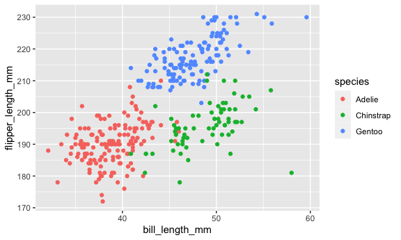

p8105_hw1_ltc2121
================

    ## ── Attaching packages ─────────────────────────────────────── tidyverse 1.3.2 ──
    ## ✔ ggplot2 3.3.6     ✔ purrr   0.3.4
    ## ✔ tibble  3.1.8     ✔ dplyr   1.0.9
    ## ✔ tidyr   1.2.0     ✔ stringr 1.4.0
    ## ✔ readr   2.1.1     ✔ forcats 0.5.1
    ## ── Conflicts ────────────────────────────────────────── tidyverse_conflicts() ──
    ## ✖ dplyr::filter() masks stats::filter()
    ## ✖ dplyr::lag()    masks stats::lag()

## Importing Data

``` r
data("penguins", package = "palmerpenguins")
```

## Penguins Data Overview

The penguins dataset has 344 rows and 8 columns. There are 8 variables
in the dataset. This includes 3 unique species of penguins and 3
different islands identified in the data. There are 168 male penguins
and 165 female penguins. The other variables in the penguin dataset
include bill length, bill depth, flipper length, body mass, and year.
The mean flipper length is 201 mm.

``` r
nrow(penguins)
## [1] 344
ncol(penguins)
## [1] 8
skimr::skim(penguins)
```

|                                                  |          |
|:-------------------------------------------------|:---------|
| Name                                             | penguins |
| Number of rows                                   | 344      |
| Number of columns                                | 8        |
| \_\_\_\_\_\_\_\_\_\_\_\_\_\_\_\_\_\_\_\_\_\_\_   |          |
| Column type frequency:                           |          |
| factor                                           | 3        |
| numeric                                          | 5        |
| \_\_\_\_\_\_\_\_\_\_\_\_\_\_\_\_\_\_\_\_\_\_\_\_ |          |
| Group variables                                  | None     |

Data summary

**Variable type: factor**

| skim_variable | n_missing | complete_rate | ordered | n_unique | top_counts                  |
|:--------------|----------:|--------------:|:--------|---------:|:----------------------------|
| species       |         0 |          1.00 | FALSE   |        3 | Ade: 152, Gen: 124, Chi: 68 |
| island        |         0 |          1.00 | FALSE   |        3 | Bis: 168, Dre: 124, Tor: 52 |
| sex           |        11 |          0.97 | FALSE   |        2 | mal: 168, fem: 165          |

**Variable type: numeric**

| skim_variable     | n_missing | complete_rate |    mean |     sd |     p0 |     p25 |     p50 |    p75 |   p100 | hist  |
|:------------------|----------:|--------------:|--------:|-------:|-------:|--------:|--------:|-------:|-------:|:------|
| bill_length_mm    |         2 |          0.99 |   43.92 |   5.46 |   32.1 |   39.23 |   44.45 |   48.5 |   59.6 | ▃▇▇▆▁ |
| bill_depth_mm     |         2 |          0.99 |   17.15 |   1.97 |   13.1 |   15.60 |   17.30 |   18.7 |   21.5 | ▅▅▇▇▂ |
| flipper_length_mm |         2 |          0.99 |  200.92 |  14.06 |  172.0 |  190.00 |  197.00 |  213.0 |  231.0 | ▂▇▃▅▂ |
| body_mass_g       |         2 |          0.99 | 4201.75 | 801.95 | 2700.0 | 3550.00 | 4050.00 | 4750.0 | 6300.0 | ▃▇▆▃▂ |
| year              |         0 |          1.00 | 2008.03 |   0.82 | 2007.0 | 2007.00 | 2008.00 | 2009.0 | 2009.0 | ▇▁▇▁▇ |

## Penguin Plot

``` r
plot_penguin = 
  ggplot(penguins, 
       aes(x = bill_length_mm, y = flipper_length_mm, color = species)) +
  geom_point()

plot_penguin
## Warning: Removed 2 rows containing missing values (geom_point).
```



``` r
ggsave("penguin_scatterplot.png", plot = plot_penguin)
## Saving 6 x 3.6 in image
## Warning: Removed 2 rows containing missing values (geom_point).
```
