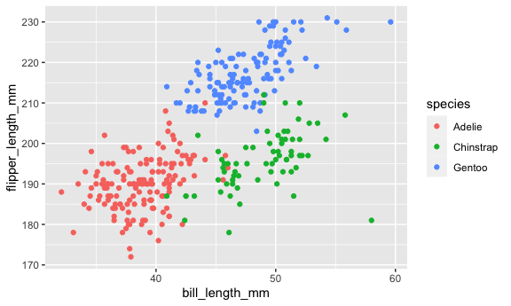

p8105_hw1_ltc2121
================

    ## ── Attaching packages ─────────────────────────────────────── tidyverse 1.3.2 ──
    ## ✔ ggplot2 3.3.6     ✔ purrr   0.3.4
    ## ✔ tibble  3.1.8     ✔ dplyr   1.0.9
    ## ✔ tidyr   1.2.0     ✔ stringr 1.4.0
    ## ✔ readr   2.1.1     ✔ forcats 0.5.1
    ## ── Conflicts ────────────────────────────────────────── tidyverse_conflicts() ──
    ## ✖ dplyr::filter() masks stats::filter()
    ## ✖ dplyr::lag()    masks stats::lag()

# Problem 1

## Importing Data

``` r
data("penguins", package = "palmerpenguins")
```

The penguins dataset has 344 rows and 8 columns. The variables in the
dataset are species, island, bill_length_mm, bill_depth_mm,
flipper_length_mm, body_mass_g, sex, year. The mean flipper length is
200.9152047 mm. The frequency among the different species of penguins in
the data is 152, 68, 124. The frequency among the different islands in
the data is 168, 124, 52. The frequency between female and male in the
dataset is 165, 168 respectively.

## Penguin Plot

``` r
plot_penguin = 
  ggplot(penguins, 
       aes(x = bill_length_mm, y = flipper_length_mm, color = species)) +
  geom_point()
plot_penguin
## Warning: Removed 2 rows containing missing values (geom_point).
```



``` r
ggsave("penguin_scatterplot.png", plot = plot_penguin)
## Saving 6 x 3.6 in image
## Warning: Removed 2 rows containing missing values (geom_point).
```

# Problem 2

## Making a Data Frame

``` r
hw_data = 
  tibble(
    vec_num = rnorm(10), 
    vec_log = (vec_num > 0), 
    vec_char = c("this", "is", "hw1", "data", "here", "that", "we", "need", "for", "class"), 
    vec_fac = factor(c("low", "mid", "high", "low", "mid", "high", "low", "mid", "high", "low"))
  )
```

## Mean of Variables

The mean can be derived from of the numbered vector and logical vector.
The character vector and factor vector result in an “NA” mean value.

``` r
hw_data %>% 
  pull(vec_num) %>% 
  mean()
## [1] 0.07371271

hw_data %>% 
  pull(vec_log) %>% 
  mean()
## [1] 0.5

hw_data %>% 
  pull(vec_char) %>% 
  mean()
## Warning in mean.default(.): argument is not numeric or logical: returning NA
## [1] NA

hw_data %>% 
  pull(vec_fac) %>% 
  mean()
## Warning in mean.default(.): argument is not numeric or logical: returning NA
## [1] NA
```

## Change Variable Type

When the character is converted to numeric the string of characters is
not recognized as another pattern and all values for the vector become
“Na”. This corresponds with the result previously received when
attempting to take the mean of the character vector.

The logical variables have an integer vector associated with their
constants. This is recognized as TRUE = 1 and FALSE = 0 which are the
values assigned to the variable once it is converted to a numeric. This
integer value is known in R which is why the mean of the logical
variable resulted in an integer.

The factor variable does not have an integer innately associated with
the factor levels and resulted in an mean of “NA”. When the factor is
converted to a numeric, it is assigned a integer number that corresponds
to the factor level.

``` r
hw_data$vec_fac <- as.numeric(hw_data$vec_fac)

hw_data$vec_char<- as.numeric(hw_data$vec_char)

hw_data$vec_log <- as.numeric(hw_data$vec_log)
```
